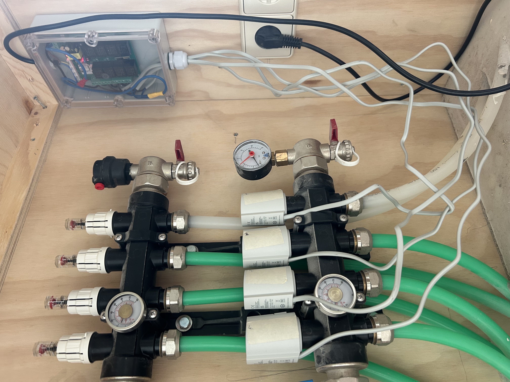
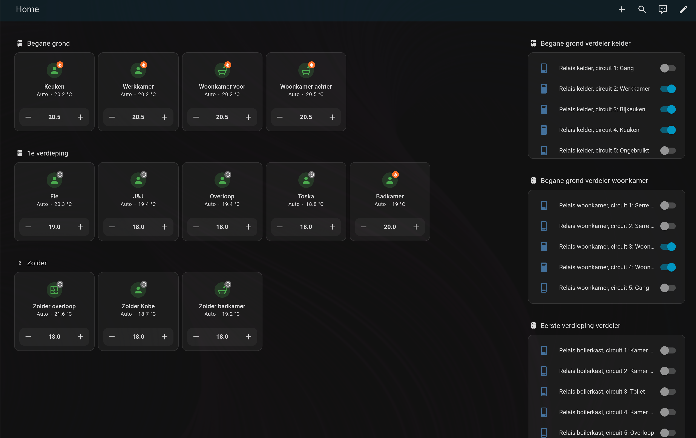

# Thermozona 💧🔥

<p align="center">
  
</p>

Welcome to **Thermozona**, the Home Assistant integration that keeps your floors smart, cozy, and energy-efficient. It steers both heating and cooling loops, so the same zoning logic works in summer and winter. With weather-aware control and a smooth HA experience, you get year-round comfort tailored to every room. 🏡✨

I built Thermozona while upgrading my own home: every underfloor heating manifold now uses Zigbee relays to drive the actuators, so each circuit can be switched independently as a zone. This project wraps that setup into a reusable integration—whether you run Zigbee, KNX, or another transport, Thermozona coordinates the relays, sensors, and heat pump so your floors stay perfectly balanced.

On the heat source side I connected an Ecoforest EcoGeo B2 over Modbus, but Thermozona itself is heat-pump agnostic: it exposes the desired heating/cooling state and flow temperature so you can mirror them—via Modbus, KNX, MQTT, or anything else—into whichever unit you own.

<p align="center">
  
  
</p>


### Dashboard example 🖥️

<p align="center">
  
</p>

The dashboard shows one thermostat per zone you define in `configuration.yaml`. Each zone maps to a separate underfloor circuit (or group of circuits), giving you granular control from Home Assistant while Thermozona keeps the heat pump in sync.

## Highlights ⚡
- 🧠 **Smart controller** – Keeps an eye on every zone and automatically switches between heating and cooling.
- 🌡️ **Weather compensation** – Dynamically adjusts flow temperature based on the outdoor climate.
- 🧩 **Flexible zones** – Combine multiple circuits per room and bring your favorite temperature sensors.
- 🎛️ **Full climate entities** – Each zone shows up as a native climate entity inside Home Assistant.
- 🚀 **Instant demo** – Ships with sample configuration so you can start experimenting right away.

## Installation 🚧

### Via HACS (recommended)
1. Open HACS in Home Assistant and choose `Integrations`.
2. Click the `⋮` menu in the top-right corner and select `Custom repositories`.
3. Add this GitHub repository, set the category to `Integration`, and confirm.
4. Search for **Thermozona** inside HACS and install it.
5. Restart Home Assistant so it loads the component.
6. Go to `Settings -> Devices & Services -> Integrations -> +`, search for **Thermozona**, and follow the config flow. 🪄

### Manual install (without HACS)
1. Copy the `custom_components/thermozona` folder into your Home Assistant config directory (`config/custom_components/`).
2. Restart Home Assistant.
3. Go to `Settings -> Devices & Services -> Integrations -> +` and search for **Thermozona**.
4. Follow the config flow to pick zones, sensors, and circuits. 🪄

## Configuration 🔧
Prefer YAML? Use this snippet as a starting point:

```yaml
thermozona:
  outside_temp_sensor: sensor.outdoor
  zones:
    living_room:
      circuits:
        - switch.manifold_living_left
        - switch.manifold_living_right
      temp_sensor: sensor.living_room
      hysteresis: 0.2
    bathroom:
      circuits:
        - switch.manifold_bathroom
      temp_sensor: sensor.bathroom
```
💡 *Tip*: Each `circuit` is a switch (or `input_boolean`) that opens a manifold loop for that zone. Combine multiple circuits per space for an even temperature.

🧮 *Need tighter control?* Override the per-zone `hysteresis` to change how far above/below the target temperature Thermozona waits before switching. Leave it out to keep the default ±0.3 °C deadband.

## Connecting Your Heat Pump 🔌

Thermozona exposes two key helpers for the plant side:
- `sensor.thermozona_heat_pump_status` reports the current demand direction (`heat`, `cool`, or `idle`). Use it to decide whether your heat pump should run and which mode it needs.
- `number.thermozona_flow_temperature` publishes the target flow temperature that Thermozona calculated from the active zones and weather curve. Push that value to your heat pump (or manifold) so the generated supply water matches the demand.

Mirror these entities through the protocol your heat pump supports (Modbus, KNX, MQTT, …) so the physical unit follows Thermozona’s lead.

For physical heat pumps such as the Ecoforest, monitor `sensor.thermozona_heat_pump_status`: write `1` for heating, `2` for cooling, and `0` when it reports `idle` so the pump stops. Need the full walkthrough? See [`docs/heatpump-ecoforest.md`](docs/heatpump-ecoforest.md).

### Example: Ecoforest heat pump via Modbus
Looking for a full example that includes Modbus entities, helper scripts, and automations? Check out `docs/heatpump-ecoforest.md`.

You can mirror the same pattern for flow-temperature numbers or additional status sensors by mapping the relevant registers to Home Assistant entities and referencing them in Thermozona.

## Under the Hood 🛠️
- 🔄 `config_flow.py` walks you through adding zones and entities step by step.
- 🌬️ `heat_pump.py` manages the heat pump, toggles it on/off, and tunes the optimal flow temperature based on demand and weather.
- 🌍 `climate.py` exposes every zone as a full-featured climate entity so you can control it from Lovelace, automations, or scripts.
- 🧰 `helpers.py` bundles utility logic to resolve circuits and sensors reliably.

## Debugging 🔎
- Enable logging in `configuration.yaml`:
  ```yaml
  logger:
    logs:
      custom_components.thermozona: debug
  ```
- Tail `home-assistant.log` to follow events in real time.
- Use Developer Tools to inspect the generated climate entities and helper sensors.

## Roadmap 🧭
- ⏱️ Support for per-zone run-on times and hysteresis.
- 📊 Gorgeous Lovelace dashboards tailored for Thermozona.
- 🧪 Unit tests for the control algorithms.
- 🌐 Comprehensive docs hosted on GitHub Pages.

## Contributing 🙌
Issues, feature requests, and pull requests are very welcome! Share how you are using Thermozona and help us make it even better. 🤗

## License 📄
Released under the MIT license. See `LICENSE` for details.

Warm regards and have fun making your floors extra comfy! 🔥🧦
